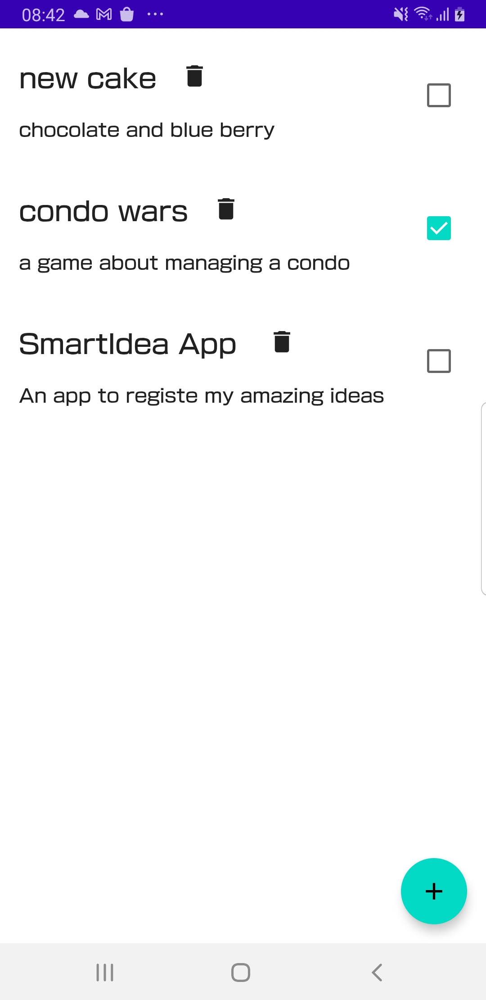

# Smart-Idea
App to register ideas

## The Brief

App that alllows user to register, update and delete ideas.
In case you regret deleting an idea you have 5 seconds to revert the decision

## Architecture & Libraries
    - MVI
    - ROOM Database
    - Dependency Injection - Dagger-Hilt
    - Kotlin Coroutines
    - Flow

## App preview:

Image #1            |      
:-------------------------:
    |

